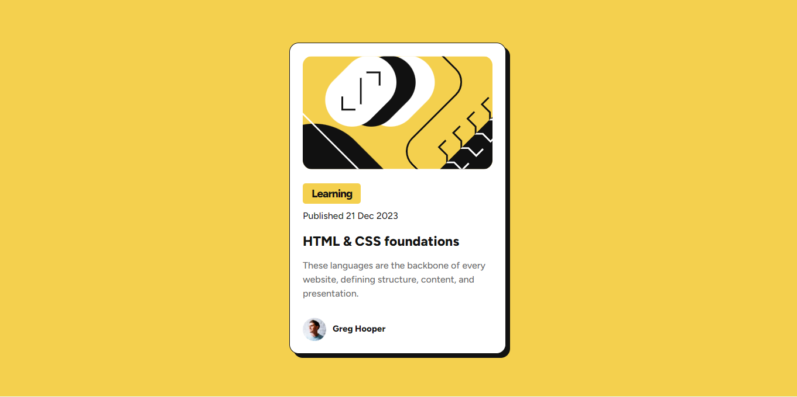

# Frontend Mentor - Blog preview card

Ma solution pour le défi Blog Preview Card de Frontend Mentor.

## Sommaire

- [Capture d'écran](#capture-décran)
- [Mon processus](#mon-processus)
- [Ce que j'ai appris](#ce-que-jai-appris)
- [Auteur](#auteur)

## Capture d'écran

## Mon processus

Pour réaliser ce projet, j'ai utilisé :

- HTML5 (Sémantique)
- CSS3 (@font-face pour la police Figtree)

## Ce que j'ai appris

J'ai appris à importer des polices d'écriture locales avec `@font-face` et à utiliser les marges négatives en CSS pour coller des éléments précisément.

## Auteur

- Mon GitHub : [https://github.com/strikerclauss-max]
- Mon profil Frontend Mentor : [https://www.frontendmentor.io/profile/Michael90-star]
